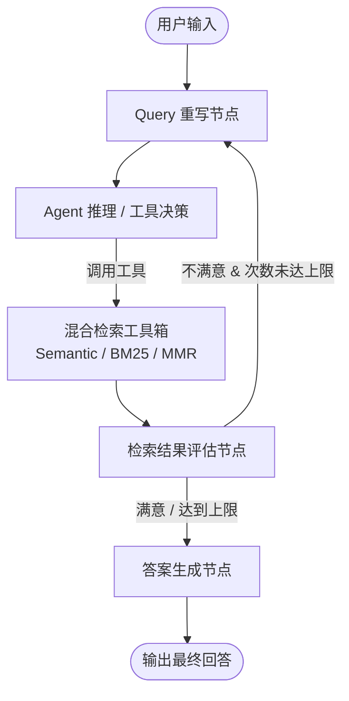

# 🤖 AI Agent Engineering Lab

<p align="center">
  
  
  
  
</p>

> 本仓库用于记录 **AI Agent & RAG 系统架构** 的核心概念实践、工程化探索与最佳实践代码库。覆盖三级记忆管理、Agentic RAG、多策略检索与 LangGraph 状态机等核心模块。

---

## 📌 目录

- [✨ 核心特性与实现进展](#-核心特性与实现进展)
- [🏗️ 系统架构设计](#️-系统架构设计)
- [🛠️ 技术栈](#️-技术栈)
- [🗺️ Roadmap & 待迭代规划](#️-roadmap--待迭代规划)
- [📂 目录结构](#-目录结构)
- [🚀 快速开始](#-快速开始)

---

## ✨ 核心特性与实现进展

### 1. 🧠 三级记忆管理器 (`memory_manager.py`)
- [x] **短期记忆**：基于 `InMemoryChatMessageHistory` 维护会话上下文。
- [x] **中期记忆**：定时将长对话压缩为结构化会话摘要，降低 Token 消耗。
- [x] **长期记忆**：基于 Chroma 向量库自动提取用户偏好与关键事实，做跨会话语义检索。

### 2. 🔍 Agentic RAG & 混合检索 (`agentic_rag.py`)
- [x] **智能路由**：基于 `StructuredTool` 封装多种检索策略（Semantic, BM25 Keyword, Hybrid, MMR）。
- [x] **Query 重写 (Query Rewriting)**：针对低质/口语化输入做关键词提取与指代消解。
- [x] **检索质量评估节点**：构建循环控制流，不满意时自动重新优化关键词并重试（最多 3 次）。

---

## 🏗️ 系统架构设计



---

## 🛠️ 技术栈

| 模块 | 选型 / 工具 |
| :--- | :--- |
| **Agent 框架** | LangChain, LangGraph |
| **向量数据库** | ChromaDB |
| **大语言模型** | OpenAI GPT-4o / 豆包 / DeepSeek |
| **可观测性** | LangSmith (Tracing & Evaluation) |
| **环境与包管理**| Python 3.10+, UV / Poetry |

---

## 🗺️ Roadmap & 待迭代规划

### 已经实现 (Completed)
- [x] LangGraph 基础状态机（State, Node, Conditional Edge）搭建
- [x] MMR（最大边际相关性）与 BM25 混合检索集成
- [x] Pylance / Standard Typing 代码规范化重构

### 正在进行 (In Progress)
- [/] **Rerank 重排序支持**：引入 BGE-Reranker-Large 对混合检索结果做二次精排。
- [/] **LangSmith 评估流水线**：搭建 RAG 自动化评估集（Context Precision / Recall）。

### 未来规划 (Planned)
- [ ] **Multi-Agent 协作**：引入 Supervisor 模式实现多 Agent 协同分工。
- [ ] **FastAPI 接口层**：封装 RESTful 接口与 SSE 流式输出。
- [ ] **Web UI**：基于 Streamlit / Next.js 构建可视化调试界面。

---

## 📂 目录结构

```text
.
├── core/
│   ├── memory/           # 记忆管理器实现
│   ├── rag/              # 向量库与检索器封装
│   └── observability.py  # LangSmith 追踪与日志配置
├── agents/
│   ├── agentic_rag.py    # 基于 LangGraph 的 Agentic RAG 实现
│   └── tools/            # 封装的 StructuredTool 集合
├── tests/                # 单元测试与 Eval 脚本
├── .env.example          # 环境变量示例文件
└── README.md
```

---

## 🚀 快速开始

### 1. 克隆仓库与安装依赖

```bash
git clone [https://github.com/your-username/your-repo-name.git](https://github.com/your-username/your-repo-name.git)
cd your-repo-name

# 推荐使用 uv 或 poetry 安装环境
pip install -r requirements.txt
```

### 2. 配置环境变量

复制 `.env.example` 为 `.env` 并填写相关 API Key：

```env
OPENAI_API_KEY="your-openai-key"
LANGCHAIN_TRACING_V2="true"
LANGCHAIN_API_KEY="your-langsmith-key"
```

### 3. 运行示例

```bash
python agents/agentic_rag.py
```